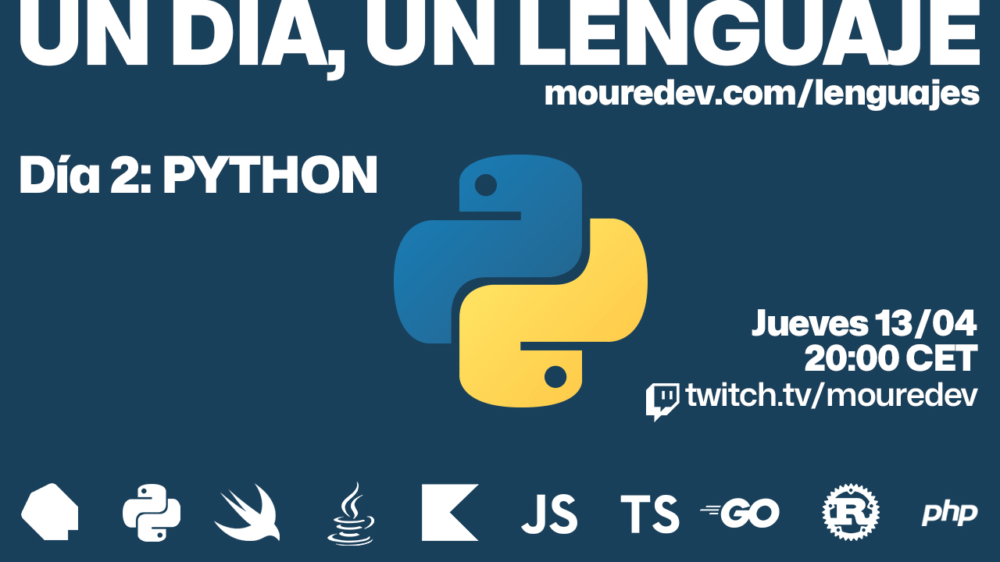

# UN DÍA, UN LENGUAJE

## Cómo dar en un día tus primeros pasos en cada lenguaje de programación

### Proyecto realizado durante emisiones en directo desde [Twitch](https://twitch.tv/mouredev). Cada semana le dedico un día a un nuevo lenguaje de programación.
> ##### Si consideras útil el curso, apóyalo haciendo "★ Star" en el repositorio. ¡Gracias!

## Introducción

Aprender un lenguaje de programación en profundidad es una tarea que exige dedicación y trabajo duro, y por supuesto, más de un día.

Con este curso no pretendo convertirte en experto en tiempo récord, simplemente quiero ayudarte a dar tus primeros pasos, responder las preguntas más frecuentes y darte unas pequeñas bases para que conozcas el lenguaje y puedas comenzar tu ruta de aprendizaje.

Mi intención es crear un recurso para aquellas personas que tienen interés en aprender o conocer cierto lenguaje.

Se llama *"Un día, un lenguaje"* porque el contenido asociado a cada lenguaje de programación se llevará a cabo durante un único día.

> Consulta la fecha de la próxima clase en directo en la sección "Calendario"

## Lo que aprenderás

Cada clase estará formada por un vídeo y código para que puedas tener una primera aproximación a un lenguaje de programación concreto. En ella trataré los siguientes lecciones:

* Introducción al lenguaje
* Configuración e instalación
* Usos habituales
* Hola mundo
* Fundamentos del lenguaje
* Sintaxis
* Próximos pasos

Así con cada uno de los lenguajes.

## Calendario

> Cada semana un día dedicado a un nuevo lenguaje

###  Día 1: Dart 

#### [Clase en vídeo](https://youtu.be/5tTDztEQzQQ) y [Código](./01%20-%20Dart)

**Recursos:** [Web oficial](https://dart.dev) | [Editor en línea](https://dartpad.dev) | [Configuración](https://dart.dev/get-dart) | [Documentación](https://dart.dev/language) | [Tutoriales](https://dart.dev/tutorials) | [Codelabs](https://dart.dev/codelabs) | [Uso con Flutter](https://flutter.dev) | [Gestor de paquetes](https://pub.dev)

###  Día 2: Python

#### [Clase en vídeo](https://www.twitch.tv/videos/1792712280?t=00h18m46s) y [Código](./02%20-%20Python)

**Recursos:** [Web oficial](https://www.python.org) | [Editor en línea](https://www.online-python.com/) | [Configuración](https://www.python.org/downloads/) | [Documentación](https://docs.python.org/es/3/) | [Tutoriales](https://mouredev.com/python) | [Libro](https://mouredev.com/libropython)

###  Día 3: Swift `PRÓXIMA CLASE`

#### Clase en directo: Jueves 26 de Abril en [Twitch](https://twitch.tv/mouredev) a las 20:00 CET
> ##### Consulta el horario por país y añade un recordatorio desde [Discord](https://discord.gg/mouredev?event=1098531243123028029) 

### Día 4: Java

> ##### Clase en directo: Próximamente...
          
### Día 5: Kotlin

> ##### Clase en directo: Próximamente...          

### Día 6: JavaScript

> ##### Clase en directo: Próximamente...

### Día 7: TypeScript

> ##### Clase en directo: Próximamente...
          
### Día 8: Go

> ##### Clase en directo: Próximamente...          

### Día 9: Rust

> ##### Clase en directo: Próximamente...

### Día 10: PHP

> ##### Clase en directo: Próximamente...

#### ¿Y después? Todo dependerá del interés de la comunidad...
          
## Preguntas frecuentes

#### ¿Qué información se publicará en este repositorio?
Toda la relacionada con el curso. Fecha de la próxima clase, vídeo del directo (una vez finalice en Twitch) o clase editada (una vez se suba a YouTube), enlaces de interés y código fuente.

#### ¿Las clases en directo quedarán grabadas?
Sí, todas las emisiones se podrán ver durante dos meses en [Twitch](https://www.twitch.tv/mouredev/videos).

#### ¿El curso se subirá a YouTube?
Sí, cada clase asociada a un nuevo lenguaje de programación se irá subiendo poco a poco a mi canal de [YouTube](https://www.youtube.com/@mouredev).

-

#### Puedes apoyar mi trabajo haciendo "☆ Star" en el repo o nominarme a "GitHub Star". ¡Gracias!

Si quieres unirte a nuestra comunidad de desarrollo, aprender programación de Apps, mejorar tus habilidades y ayudar a la continuidad del proyecto, puedes encontrarnos en:

##  Hola, mi nombre es Brais Moure.
### Freelance full-stack iOS & Android engineer

Soy ingeniero de software desde hace más de 12 años. Desde hace 4 años combino mi trabajo desarrollando Apps con creación de contenido formativo sobre programación y tecnología en diferentes redes sociales como **[@mouredev](https://moure.dev)**.

### En mi perfil de GitHub tienes más información

