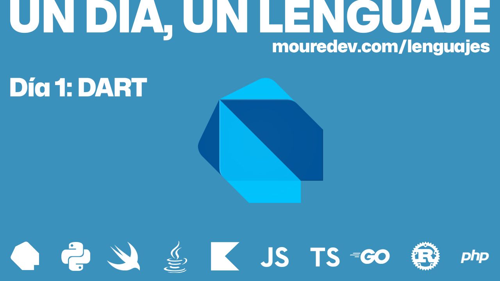
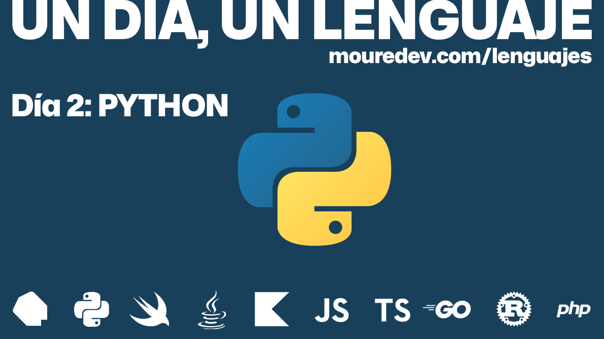
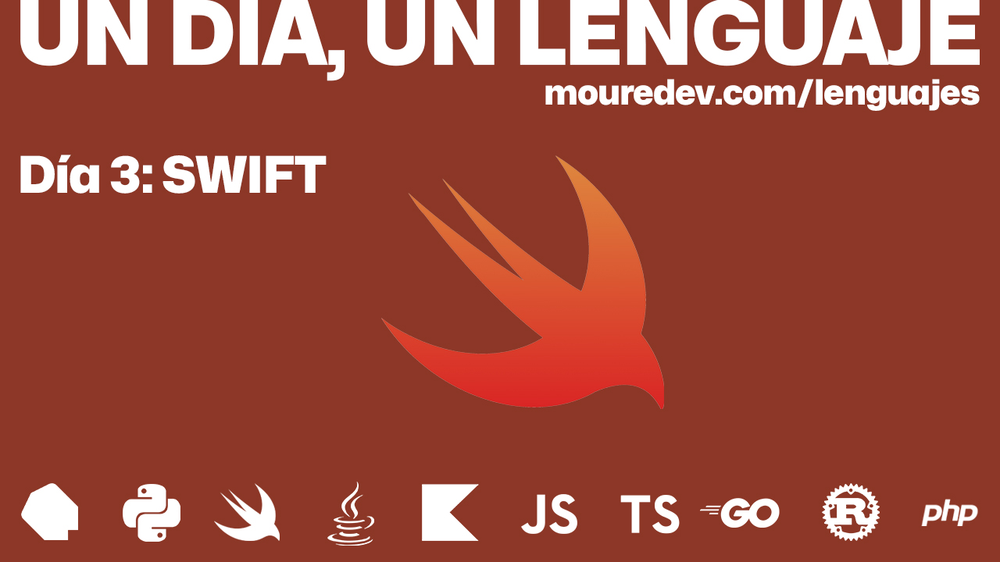
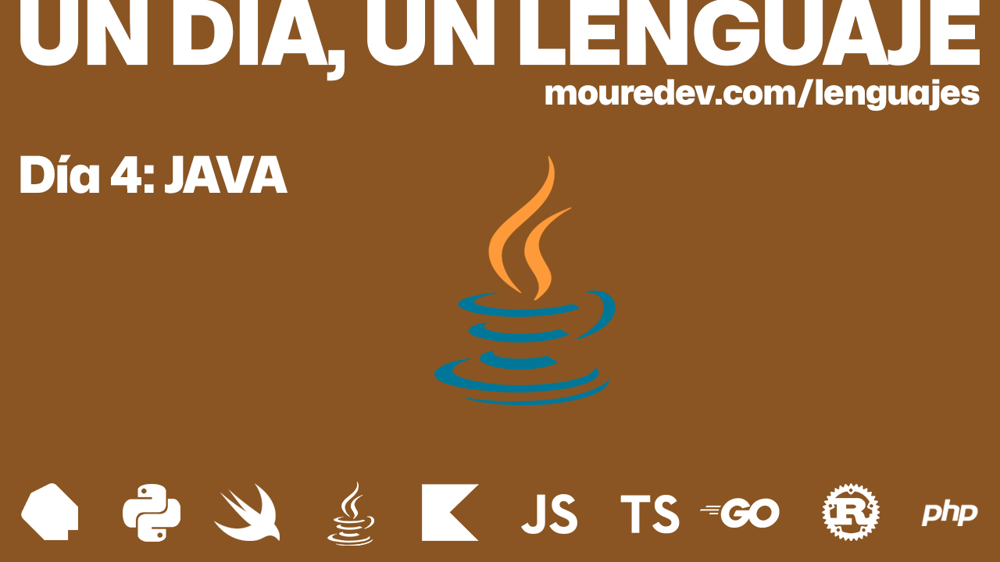
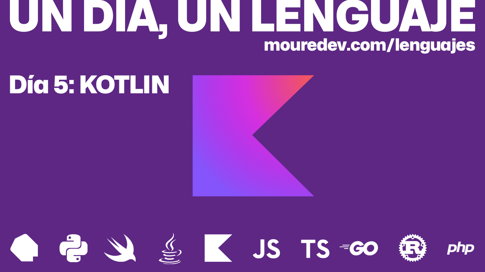
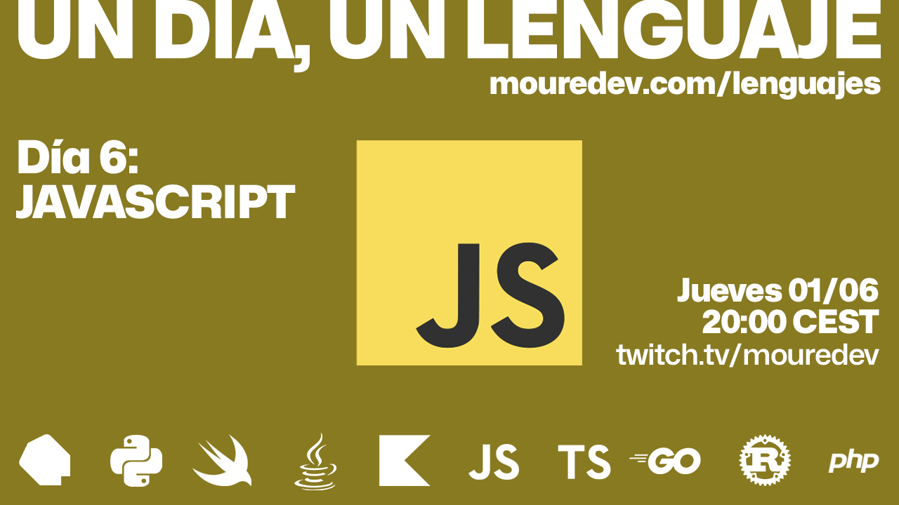
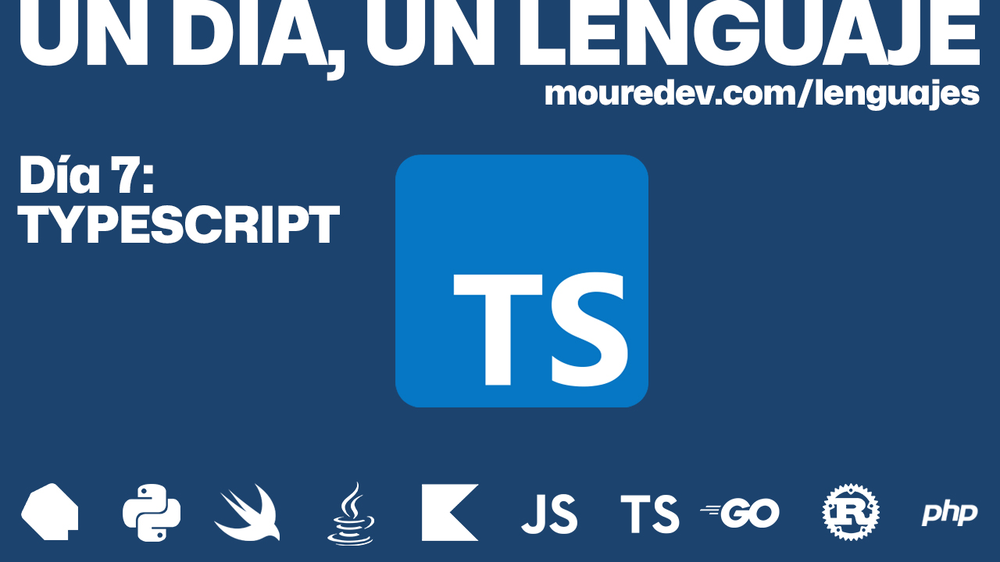
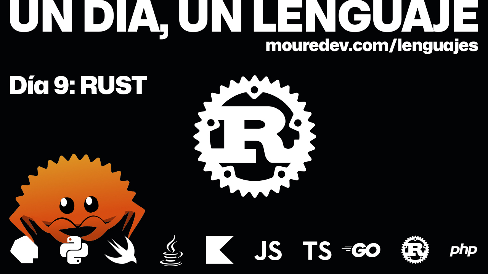
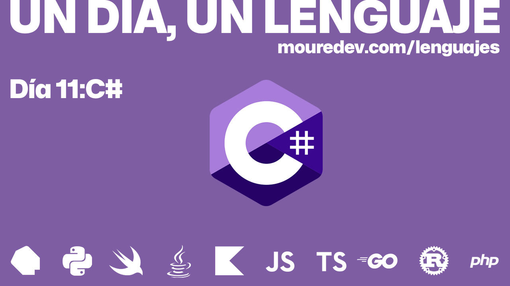

# UN DÍA, UN LENGUAJE

## Cómo dar en un día tus primeros pasos en cada lenguaje de programación

### Proyecto realizado durante emisiones en directo desde [Twitch](https://twitch.tv/mouredev). Cada semana le dedico un día a un nuevo lenguaje de programación.
> ##### Si consideras útil el curso, apóyalo haciendo "★ Star" en el repositorio. ¡Gracias!

## Introducción

Aprender un lenguaje de programación en profundidad es una tarea que exige dedicación y trabajo duro, y por supuesto, más de un día.

Con este curso no pretendo convertirte en experto en tiempo récord, simplemente quiero ayudarte a dar tus primeros pasos, responder las preguntas más frecuentes y darte unas pequeñas bases para que conozcas el lenguaje y puedas comenzar tu ruta de aprendizaje.

Mi intención es crear un recurso para aquellas personas que tienen interés en aprender o conocer cierto lenguaje.

Se llama *"Un día, un lenguaje"* porque el contenido asociado a cada lenguaje de programación se llevará a cabo durante un único día.

> Consulta la fecha de la próxima clase en directo en la sección "Calendario"

## Lo que aprenderás

Cada clase estará formada por un vídeo y código para que puedas tener una primera aproximación a un lenguaje de programación concreto. En ella trataré los siguientes lecciones:

* Introducción al lenguaje
* Configuración e instalación
* Usos habituales
* Hola mundo
* Fundamentos del lenguaje
* Sintaxis
* Próximos pasos

Así con cada uno de los lenguajes.

## Calendario

> Cada semana un día dedicado a un nuevo lenguaje

###  Día 1: Dart 

#### [Clase en vídeo](https://youtu.be/5tTDztEQzQQ) y [Código](./01%20-%20Dart)

**Recursos:** [Web oficial](https://dart.dev) | [Editor en línea](https://dartpad.dev) | [Configuración](https://dart.dev/get-dart) | [Documentación](https://dart.dev/language) | [Tutoriales](https://dart.dev/tutorials) | [Codelabs](https://dart.dev/codelabs) | [Uso con Flutter](https://flutter.dev) | [Gestor de paquetes](https://pub.dev)

###  Día 2: Python

#### [Clase en vídeo](https://youtu.be/WatTqrq8kQQ) y [Código](./02%20-%20Python)

**Recursos:** [Web oficial](https://www.python.org) | [Editor en línea](https://www.online-python.com/) | [Configuración](https://www.python.org/downloads/) | [Documentación](https://docs.python.org/es/3/) | [Tutoriales](https://mouredev.com/python) | [Libro](https://mouredev.com/libropython)

###  Día 3: Swift

#### [Clase en vídeo](https://youtu.be/kpsVJptSv1U) y [Código](./03%20-%20Swift)

**Recursos:** [Web oficial](https://www.swift.org) | [Web oficial Apple](https://www.apple.com/es/swift) | [Editor en línea](https://swiftfiddle.com/) | [Configuración](https://www.swift.org/download/) | [Documentación](https://www.swiftbook.es/) | [Uso con SwiftUI](https://developer.apple.com/xcode/swiftui/) | [Uso con Vapor](https://vapor.codes/) | [Tutoriales Swift](https://www.youtube.com/watch?v=Wfh0FYR0z6I&list=PLNdFk2_brsRcWM-31vJUgyHIGpopIDw4s) | [Tutoriales SwiftUI](https://developer.apple.com/tutorials/swiftui)

###  Día 4: Java

#### [Clase en vídeo](https://youtu.be/W86KTBSiX2o) y [Código](./04%20-%20Java)

**Recursos:** [Web oficial](https://www.java.com/es/) | [Editor en línea](https://www.online-java.com) | [Configuración](https://www.java.com/es/download/help/index_installing.html) | [Documentación](https://docs.oracle.com/en/java/) | [Tutorial](https://www.w3schools.com/java/)

###  Día 5: Kotlin

#### [Clase en vídeo](https://youtu.be/T3ugOYTRF7c) y [Código](./05%20-%20Kotlin)

**Recursos:** [Web oficial](https://kotlinlang.org) | [Web JetBrains](https://www.jetbrains.com/es-es/opensource/kotlin) | [Web Android](https://developer.android.com/kotlin?hl=es-419) | [Editor en línea](https://play.kotlinlang.org) | [Configuración](https://kotlinlang.org/docs/getting-started.html) | [Documentación](https://kotlinlang.org/docs/home.html) | [Tutorial](https://kotlinlang.org/docs/kotlin-tour-hello-world.html) | [Cursos Kotlin](https://kotlinlang.org/education/courses.html) | [Cursos Android](https://developer.android.com/courses?hl=es-419) | [Cursos JetBrains](https://www.jetbrains.com/academy/#learn)

###  Día 6: JavaScript

#### [Clase en vídeo](https://youtu.be/6cnFl9aHD5Y) y [Código](./06%20-%20JavaScript)

**Recursos:** [Web oficial](https://developer.mozilla.org/es/docs/Web/JavaScript) | [Editor en línea](https://playcode.io/javascript-compiler) | [Tutorial Mozilla](https://developer.mozilla.org/es/docs/Web/JavaScript) | [Documentación](https://developer.mozilla.org/es/docs/Learn/JavaScript/First_steps) | [Tutorial W3Schools](https://www.w3schools.com/js/) | [Libro Aprendiendo JavaScript](https://mouredev.com/aprendiendojs)

###  Día 7: TypeScript

#### [Clase en vídeo](https://youtu.be/4W3UWjyyVkQ) y [Código](./07%20-%20TypeScript)

**Recursos:** [Web oficial](https://www.typescriptlang.org/es/) | [Editor en línea](https://www.typescriptlang.org/es/play) | [Configuración](https://www.typescriptlang.org/download) | [Documentación](https://www.typescriptlang.org/es/docs/) | [Tutorial W3Schools](https://www.w3schools.com/typescript/index.php) | [Tutorial Microsoft](https://learn.microsoft.com/es-es/training/browse/?terms=typescript)
          
###  Día 8: Go

#### [Clase en vídeo](https://youtu.be/AGiayASyp2Q) y [Código](./08%20-%20Go)

**Recursos:** [Web oficial](https://go.dev) | [Editor en línea](https://go.dev/play/) | [Configuración](https://go.dev/doc/install) | [Documentación](https://go.dev/doc) | [Tutorial](https://go.dev/learn) | [Tutorial Microsoft](https://learn.microsoft.com/es-es/training/paths/go-first-steps/)        

###  Día 9: Rust

#### [Clase en vídeo](https://youtu.be/GWprpnIG-w4) y [Código](./09%20-%20Rust)

**Recursos:** [Web oficial](https://www.rust-lang.org/es/) | [Editor en línea](https://play.rust-lang.org/) | [Configuración](https://www.rust-lang.org/es/learn/get-started) | [Documentación](https://www.rust-lang.org/es/learn) | [Tutorial](https://doc.rust-lang.org/rust-by-example/) | [Libro](https://github.com/Phosphorus-M/rust-book-es)      

###  Día 10: PHP

#### [Clase en vídeo](https://youtu.be/nPCJAx5c1uE) y [Código](./10%20-%20PHP)

**Recursos:** [Web oficial](https://www.php.net) | [Editor en línea](https://paiza.io/es/projects/new) | [Configuración](https://www.php.net/manual/es/install.php) | [Documentación](https://www.php.net/manual/es/) | [Tutorial](https://www.php.net/manual/es/langref.php) | [Tutorial W3Schools](https://www.w3schools.com/php/)

###  Día 11: C Sharp

#### [Clase en vídeo](https://youtu.be/L-f8u0hwi4Y) y [Código](./11%20-%20CSharp)

**Recursos:** [Web oficial](https://dotnet.microsoft.com) | [Editor en línea](https://sharplab.io) | [Configuración](https://dotnet.microsoft.com/download) | [Documentación](https://learn.microsoft.com/es-es/dotnet/csharp/) | [Tutorial](https://dotnet.microsoft.com/learn/csharp) | [Unity](https://unity.com)     

#### ¿Quieres más lenguajes? Haz "star" por el repo y dime por redes qué lenguaje te gustaría añadir.
          
## Preguntas frecuentes

#### ¿Qué información se publicará en este repositorio?
Toda la relacionada con el curso. Fecha de la próxima clase, vídeo del directo (una vez finalice en Twitch) o clase editada (una vez se suba a YouTube), enlaces de interés y código fuente.

#### ¿Las clases en directo quedarán grabadas?
Sí, todas las emisiones se podrán ver durante dos meses en [Twitch](https://www.twitch.tv/mouredev/videos).

#### ¿El curso se subirá a YouTube?
Sí, cada clase asociada a un nuevo lenguaje de programación se irá subiendo poco a poco a mi canal de [YouTube](https://www.youtube.com/@mouredev).

-

#### Puedes apoyar mi trabajo haciendo "☆ Star" en el repo. ¡Gracias!

## Únete al campus de programación de la comunidad

#### Te presento [mouredev pro](https://mouredev.pro), mi proyecto más importante para ayudarte a estudiar programación y desarrollo de software de manera diferente.

> **¿Buscas un extra?** Aquí encontrarás mis cursos editados por lecciones individuales, para avanzar a tu ritmo y guardar el progreso. También dispondrás de ejercicios y correcciones, test para validar tus conocimientos, examen y certificado público de finalización, soporte, foro de estudiantes, reunionnes grupales, cursos exclusivos y mucho más.
> 
> Entra en **[mouredev.pro](https://mouredev.pro)** y utiliza el cupón **"PRO"** con un 10% de descuento en tu primera suscripción.

##  Hola, mi nombre es Brais Moure.
### Freelance full-stack iOS & Android engineer

Soy ingeniero de software desde 2010. Desde 2018 combino mi trabajo desarrollando Apps con la creación de contenido formativo sobre programación y tecnología en diferentes redes sociales como **[@mouredev](https://moure.dev)**.

Si quieres unirte a nuestra comunidad de desarrollo, aprender programación, mejorar tus habilidades y ayudar a la continuidad del proyecto, puedes encontrarnos en:

 
 
